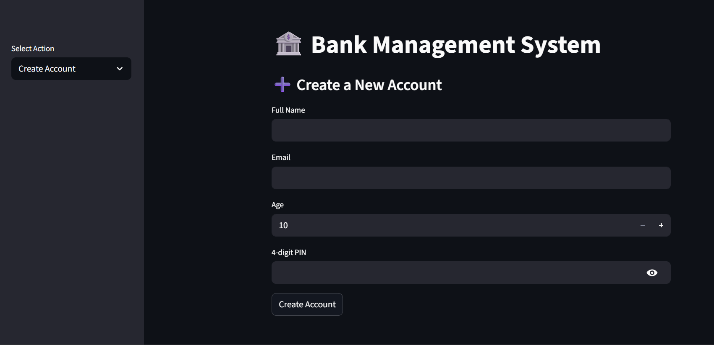
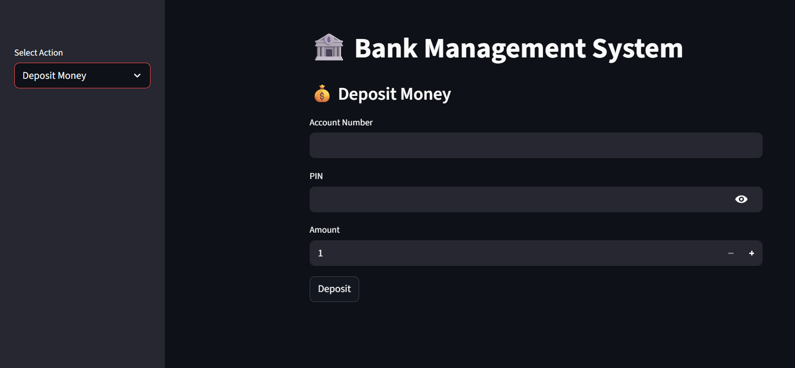
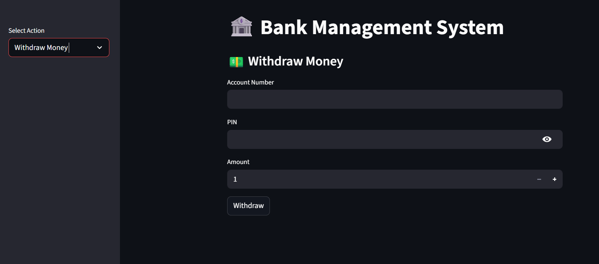
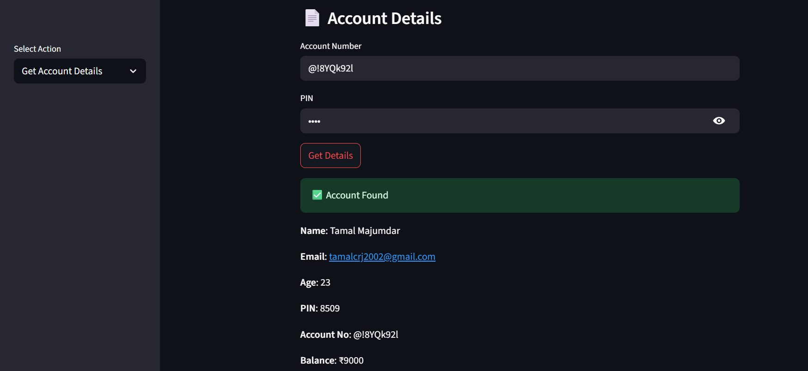
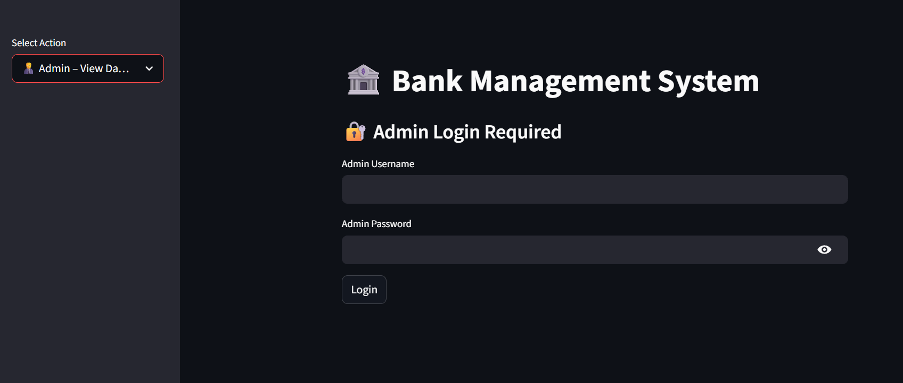

# 🏦 Banking System (SQLite + Python + Streamlit) [](https://banking-system-st.streamlit.app/)

This is a **Bank Management System** built with **Python, SQLite, and Streamlit**.
It allows users to create accounts, deposit/withdraw money, update details, and view account information.

✅ A **special feature** is added for **Admin only**:
The admin can log in and **view the entire database directly from the frontend**, without manually opening `bank.db`.

---

## 🚀 Features

* **User Features**

  * Create a new account (with Name, Email, Age, PIN, Auto-generated Account Number)
  * Deposit money (up to ₹10,000 per transaction)
  * Withdraw money (if balance is sufficient)
  * View account details securely using PIN
  * Update name, email, or PIN
  * Delete account permanently

* **Admin Features**

  * Secure admin login 
  * View the entire database inside the Streamlit app
    👉 Eliminates the need to manually open `bank.db`
  * Download database records as CSV
  * Logout functionality

---

## 🗄 Database Schema

**Table: `accounts`**

| Column       | Type    | Description                            |
| ------------ | ------- | -------------------------------------- |
| `id`         | INTEGER | Auto-increment primary key             |
| `name`       | TEXT    | Account holder’s name                  |
| `email`      | TEXT    | Email address                          |
| `age`        | INTEGER | Account holder’s age                   |
| `pin`        | INTEGER | 4-digit PIN for login security         |
| `account_no` | TEXT    | Unique account number (auto-generated) |
| `balance`    | INTEGER | Current balance (default: 0)           |

---

## 📂 Project Structure

```
Bank_Main/
│── bank.db         # SQLite database
│── database.py     # DB initialization & schema creation
│── main.py         # Main Streamlit app (frontend + backend integration)
│── design.md       # Project design / documentation
│── README.md       # Documentation (this file)
```

---

## ⚙️ Installation & Setup

1. Clone this repository:

   ```bash
   git clone https://github.com/Tom-1508/banking-system.git
   cd banking-system
   ```

2. Install dependencies:

   ```bash
   pip install streamlit pandas
   ```

3. Initialize database (run once):

   ```bash
   python database.py
   ```

4. Start the app:

   ```bash
   streamlit run main.py
   ```

---

## 📸 Screenshots (Recommended)

* User Account Creation


* Deposit/Withdraw Interface



* Account Details View


* **Admin Database View** (special feature)


---

## 💡 Future Improvements

* Add **transaction history logs**
* Secure PIN storage using **hashing**
* Email-based verification for account recovery
* Support for **loans & interest calculation**

---

## 👨‍💻 Author

**Tamal Majumdar**
📧 [tamalcrj2002@gmail.com](mailto:tamalcrj2002@gmail.com)

---
